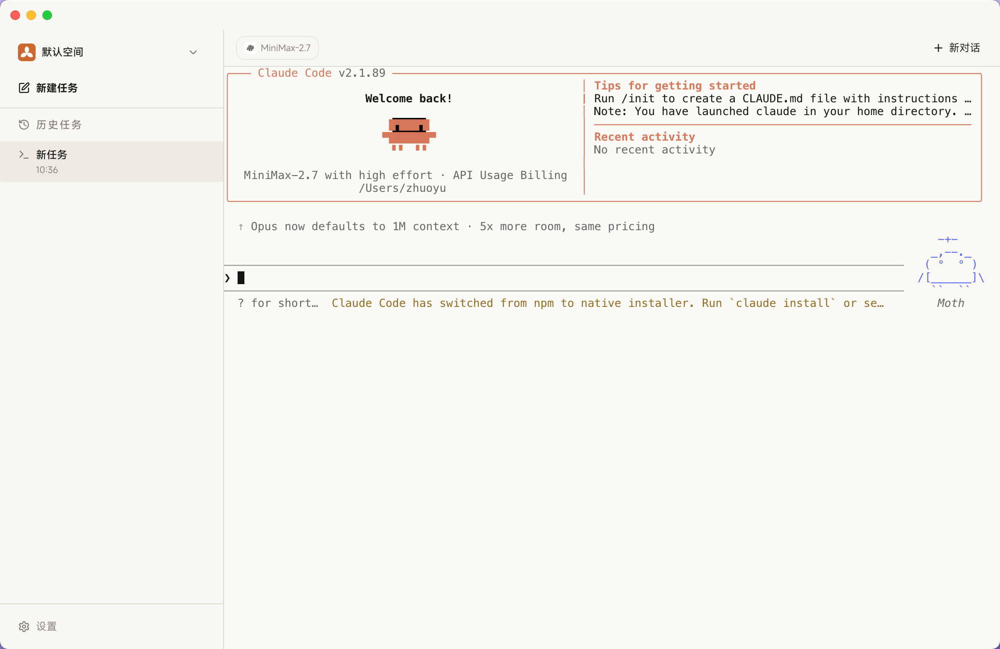
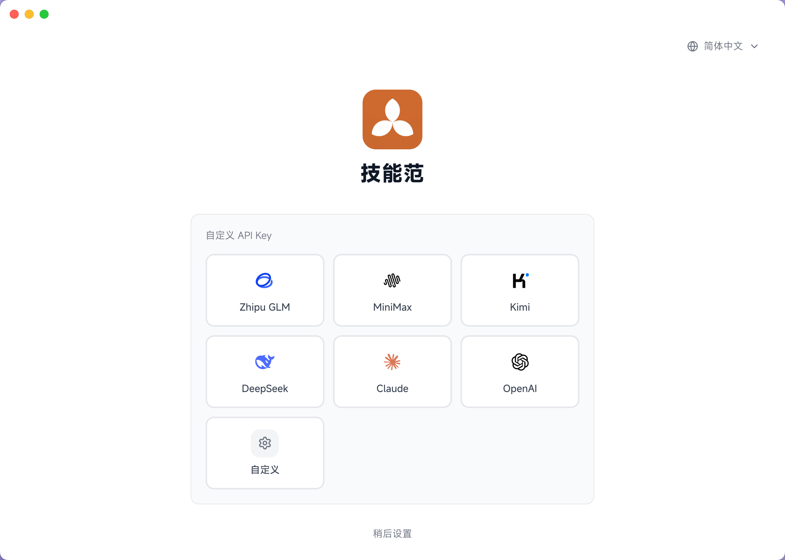
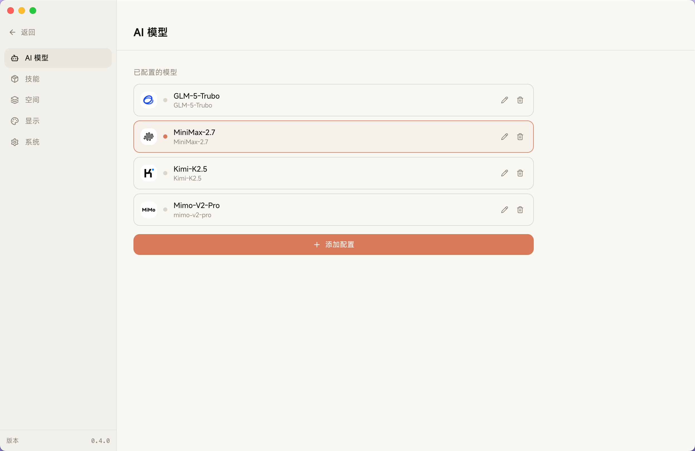
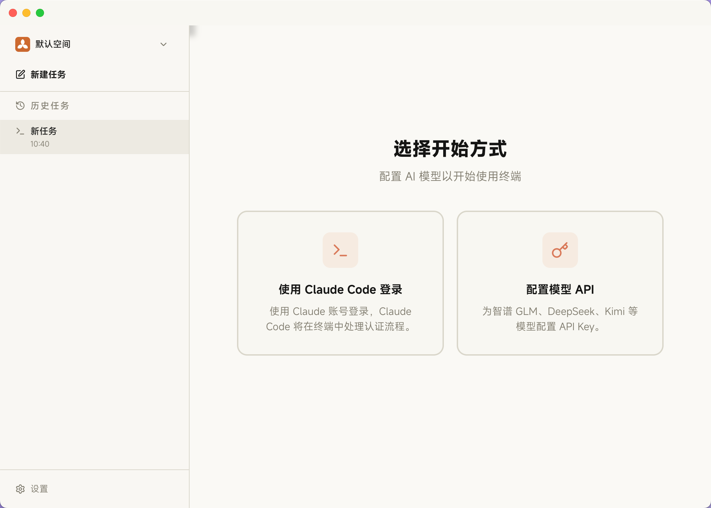
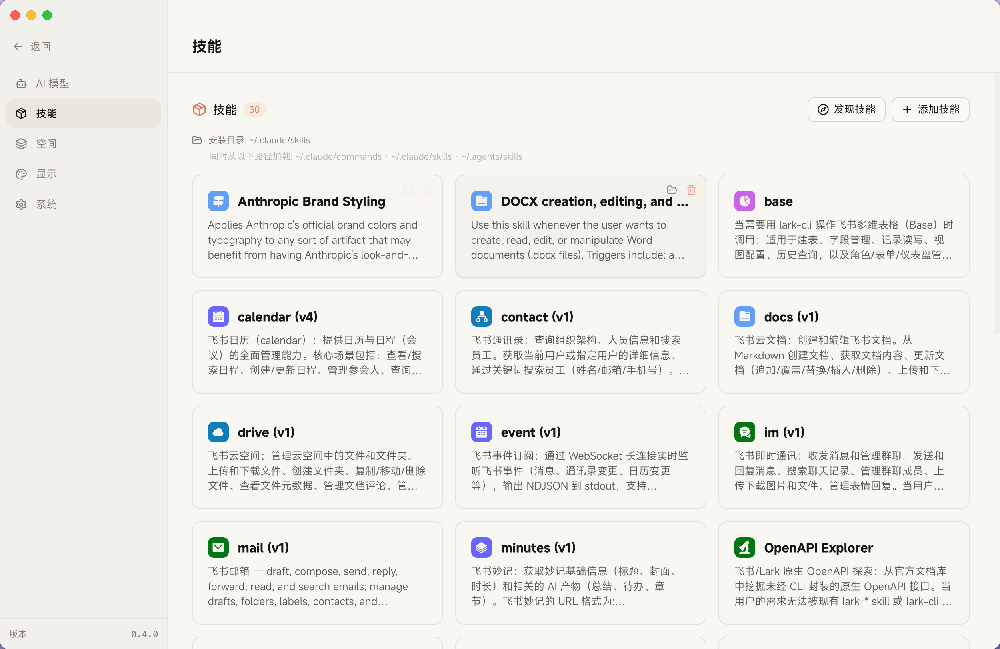

<div align="center">


# 技能范 SkillsFan

**让 Claude Code 的安装和使用，跟普通软件一样简单。**

不用敲命令，不用配环境，不用翻墙订阅。下载，打开，就能用。

[🇨🇳 国内下载 skills.fan](https://www.skills.fan/download) · [🌏 海外下载 skillsfan.com](https://skillsfan.com/download)

**中文** | [English](./docs/README.en.md)

</div>

---

<div align="center">

</div>

---

## 为什么需要技能范？

Claude Code 是目前最强大的 AI Agent —— 它不只是聊天工具，而是能真正帮你做事：写代码、创建文件、运行命令、浏览网页、反复迭代直到任务完成。无论是编程开发还是日常办公自动化，它都表现出色。

**但在国内使用 Claude Code，门槛极高：**

- **装不上** —— Claude Code 依赖 Node.js 和命令行安装，网络环境又经常导致下载失败，很多人卡在第一步
- **用不了** —— Claude Code 仅限 Pro（$20/月）和 Max（$100-200/月）订阅用户，而这两个方案无论是支付方式还是网络环境，对国内用户都极不友好
- **换不了模型** —— 如果想接入智谱、DeepSeek、Kimi 等国内模型，配置过程非常繁琐，需要手动修改环境变量和配置文件

从安装、到订阅、到模型替换，每一步都是门槛 —— 不只是对非开发者，即使对开发者来说也很折腾。

### 技能范把这道墙拆了。

我们把 Claude Code 完整的 Agent 能力包装进一个桌面应用，让它变成一个**下载即用的普通软件**。不需要 Node.js，不需要终端，不需要订阅海外服务。输入一个国内模型的 API Key，就能立即开始使用。

| | Claude Code | 技能范 |
|---|:---:|:---:|
| 完整 Agent 能力 | ✅ | ✅ |
| 下载安装包，一键安装 | ❌ | ✅ |
| 支持国产模型（Kimi、MiniMax、GLM 等） | ❌ | ✅ |
| 无需 Claude Code Pro/Max 会员订阅 | ❌ | ✅ |
| 完善的 Skills 技能市场生态 | ❌ | ✅ |
| 友好的可视化界面 | ❌ | ✅ |

---

## 功能一览

### 国内模型开箱即用

告别繁琐的环境变量配置。技能范内置国内主流模型的预设，选择供应商、输入 API Key，两步搞定。

<div align="center">
<table>
<tr>
<td align="center"><br><em>选择你的模型供应商</em></td>
<td align="center"><br><em>管理多个模型配置</em></td>
</tr>
</table>
</div>

**已适配的模型：**
- 🇨🇳 **国内模型** — 智谱 GLM、MiniMax、Kimi（月之暗面）、DeepSeek、小米 MiMo
- 🌐 **海外模型** — Claude、OpenAI、OpenRouter
- 🔧 **自定义接入** — 支持任意 Anthropic / OpenAI 兼容格式的 API

### 无需订阅，跳过登录

使用技能范不需要 Claude Code 的 Pro 或 Max 账号，也不需要特殊的网络环境。只要有一个国内模型的 API Key（大部分提供免费额度），就能获得完整的 Agent 体验。

<div align="center">

<p><em>选择「配置模型 API」，无需 Claude 账号即可开始</em></p>
</div>

### Skills 技能系统

通过 `/` 命令快速调用预设的 AI 工作流，让复杂任务一键完成。技能范与 [skills.fan 技能市场](https://www.skills.fan) 全面打通 —— 在网站浏览、搜索社区共创的高质量技能包，一键安装到本地即可使用。

<div align="center">
<table>
<tr>
<td align="center"><br><em>在应用内管理已安装的技能</em></td>
<td align="center"><br><em><a href="https://www.skills.fan">skills.fan</a> 技能市场，发现更多技能</em></td>
</tr>
</table>
</div>

- 📦 **开箱即用** — 预装常用技能，输入 `/` 即可调用
- 🛒 **技能市场** — 在 [skills.fan](https://www.skills.fan) 浏览和安装社区技能，与应用无缝打通
- 🔧 **自定义技能** — 创建你自己的 AI 工作流并分享给社区

### 更多特性

- 🌏 **多语言支持** — 简体中文、繁体中文、英文、日文、西班牙语、法语、德语
- 🌓 **深色 / 浅色主题** — 跟随系统或手动切换

更多功能陆续更新中，敬请期待。

---

## 下载安装

<div align="center">

[🇨🇳 国内下载 skills.fan](https://www.skills.fan/download) · [🌏 海外下载 skillsfan.com](https://skillsfan.com/download)

支持 **macOS** (Apple Silicon / Intel) · **Windows**

</div>

下载、安装、打开 —— 跟你装任何其他软件一样。不需要 Node.js，不需要 npm，不需要任何命令行操作。

### 从源码构建

```bash
git clone https://github.com/nicepkg/skillsfan.git
cd skillsfan
npm install
npm run dev
```

---

## 快速上手

1. **下载并安装技能范** — 从 [skills.fan](https://www.skills.fan/download) 或 [skillsfan.com](https://skillsfan.com/download) 下载
2. **选择「配置模型 API」** — 无需 Claude 账号，直接使用国内模型
3. **输入 API Key** — 选择你的模型供应商，粘贴 Key 即可
4. **开始对话** — 试试「帮我做一个个人网站」或「帮我整理这份数据」

> **小技巧：** 输入 `/` 可以快速调用 Skills 技能包，效率翻倍。

---

## 社区

- [GitHub Discussions](https://github.com/nicepkg/skillsfan/discussions) — 提问与交流
- [Issues](https://github.com/nicepkg/skillsfan/issues) — Bug 反馈与功能建议
- 微信：zy04080034

---

## 许可证

本项目未经授权不可用于商业用途，违者将依法追究法律责任。详见 [LICENSE](LICENSE)。

---

<div align="center">

**给个 Star ⭐ 让更多人发现这个项目**

[回到顶部](#技能范-skillsfan)

</div>
