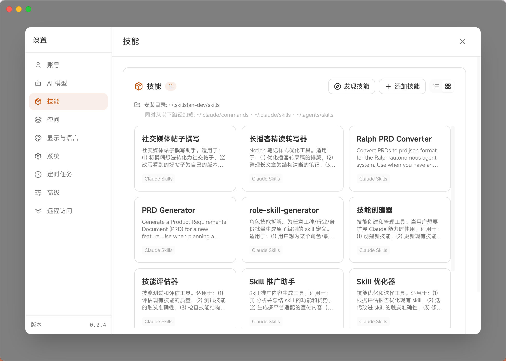
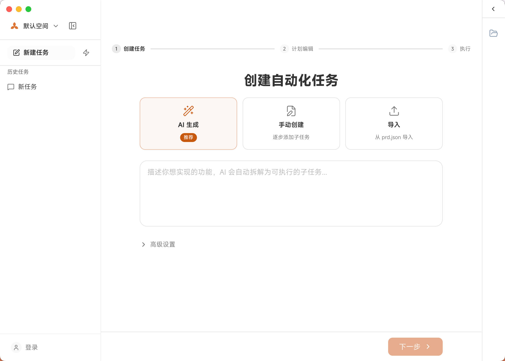

<div align="center">


# SkillsFan

**让每个人都能用上 AI Agent 的桌面平台**

不需要终端，不需要编程经验。下载、安装、开始创造。

[](https://github.com/skillsfan/desktop/stargazers)
[](LICENSE)
[](#installation)
[](https://github.com/skillsfan/desktop/releases)
[](https://github.com/skillsfan/desktop/releases/latest)

[下载安装](#installation) · [快速上手](#quick-start) · [功能一览](#features) · [参与贡献](#contributing)

**[English](./docs/README.en.md)** | **[繁體中文](./docs/README.zh-TW.md)** | **[日本語](./docs/README.ja.md)** | **[Español](./docs/README.es.md)** | **[Français](./docs/README.fr.md)** | **[Deutsch](./docs/README.de.md)**

</div>

---

<div align="center">


</div>

---

## Why SkillsFan?

AI Agent 是目前最强大的 AI 使用方式 —— 它不只是回答问题，而是能真正帮你做事：写代码、创建文件、运行命令、浏览网页，反复迭代直到任务完成。

但问题是，大多数 AI Agent 工具都藏在终端里。对于不熟悉命令行的人来说，这是一道看不见的墙。

**SkillsFan 把这道墙拆了。**

我们把完整的 AI Agent 能力包装进一个任何人都能用的桌面应用：一键安装，打开就用，支持多种 AI 模型，还能从手机远程控制。无论你是开发者、设计师、产品经理还是学生，都能用它来完成各种复杂任务。

| | 传统 AI Agent (CLI) | SkillsFan |
|---|:---:|:---:|
| 完整 Agent 能力 | ✅ | ✅ |
| 可视化界面 | ❌ | ✅ |
| 一键安装，无需配置环境 | ❌ | ✅ |
| 多模型支持 | ❌ | ✅ |
| 手机/平板远程访问 | ❌ | ✅ |
| 文件实时预览 | ❌ | ✅ |
| 内置 AI 浏览器 | ❌ | ✅ |
| 自动化任务编排 | ❌ | ✅ |

---

## Features

### 核心能力

🔄 **真正的 Agent Loop** — 不是简单聊天。AI 能写代码、创建文件、运行命令，自动迭代直到任务完成。

📂 **Space 工作空间** — 每个项目一个独立空间，文件、对话、上下文完全隔离，互不干扰。

📎 **Artifact Rail** — 右侧文件面板实时展示 AI 创建和修改的文件，支持 HTML、代码、图片、Excel、CSV、Markdown 预览。

🖥️ **Content Canvas** — 双栏视图，代码语法高亮，HTML 实时预览，多 Tab 自由切换。

### 智能交互

⚡ **流式输出** — 字符级实时展示 AI 回复，等待不再煎熬。

🧠 **思维过程面板** — 展开查看 AI 每一步的工具调用和执行结果，了解它在做什么。

💡 **扩展思考** — 查看 AI 内部的推理过程，支持 Off / Low / Medium / High 四档深度控制。

🎯 **智能跟进建议** — AI 回复后自动提炼 2-3 个可点击的跟进方向，对话更流畅。

📄 **文件附件** — 粘贴或拖放上传图片、PDF、Word、Excel，AI 直接理解文件内容。

📊 **Token 用量指示器** — 实时显示 context 占用和成本，使用更透明。

✏️ **注入消息** — 生成过程中随时插入新指令，引导 AI 调整方向。

### Skills 技能系统

🧩 **Skills 技能包** — 可复用的 AI 指令集，通过 `/` 命令快速调用，一键搞定常见任务。

📦 **多来源支持** — SkillsFan 官方技能库 + Claude Code 命令 + 自定义技能，灵活组合。

🗂️ **技能管理** — 列表/网格视图浏览，预览内容，安装和删除。

### Loop Task 自动化

🔁 **Loop Task** — 描述一个大目标，AI 自动拆解为多个子任务并逐一执行。

📝 **三种创建方式** — AI 智能拆解、手动创建、或导入 prd.json 文件。

✅ **质量门控** — 为每个子任务设置验收标准，确保输出质量。

🔄 **自动重试 & 崩溃恢复** — 失败自动重试，应用重启后自动恢复中断的任务。

⏰ **定时调度** — 支持 Cron 表达式或固定间隔，定时自动执行任务。

### AI Browser

🌐 **内置 AI 浏览器** — AI 控制真实 Chromium 浏览器，点击、填表、拖放、截图、执行 JavaScript。

📡 **网络/控制台监控** — 捕获网络请求和控制台日志，调试更方便。

📱 **设备仿真** — 模拟不同设备、分辨率和网络条件。

### 远程访问

🌍 **跨设备控制** — 从手机、平板或任何浏览器远程操控桌面上的 SkillsFan。

🔗 **局域网 + 公网** — 同一网络直接访问，或通过 Cloudflare Tunnel 一键生成公网 HTTPS 链接。

🔒 **Token 认证** — 内置安全机制，保护远程访问安全。

### 多模型支持

🤖 **开箱即用** — 内置 Claude、OpenAI、DeepSeek、智谱 GLM、Kimi、MiniMax 等预设配置。

🔑 **GitHub Copilot** — 支持 OAuth 登录直接使用。

🔧 **自定义 API** — 支持 Anthropic / OpenAI / 兼容格式，自动协议转换。

### 更多

🌏 7 种语言（英文、简中、繁中、日文、西班牙语、法语、德语） · 🌓 深色/浅色主题 · 🧠 跨会话记忆 · 🔍 对话搜索（当前/Space/全局） · 👥 Agent 团队协作（实验性） · 💻 系统托盘后台运行 · 🚀 开机自启动 · 📦 自动更新

---

## Screenshots

### 聊天与创作


### Skills 技能管理



### Loop Task 自动化任务



### 远程访问


<p align="center">
  
  &nbsp;&nbsp;
  
</p>

---

<h2 id="installation">Installation</h2>

### 直接下载（推荐）

| 平台 | 下载 | 系统要求 |
|------|------|---------|
| **macOS** (Apple Silicon) | [下载 .dmg](https://github.com/skillsfan/desktop/releases/latest) | macOS 11+ |
| **macOS** (Intel) | [下载 .dmg](https://github.com/skillsfan/desktop/releases/latest) | macOS 11+ |
| **Windows** | [下载 .exe](https://github.com/skillsfan/desktop/releases/latest) | Windows 10+ |
| **Linux** | [下载 .AppImage](https://github.com/skillsfan/desktop/releases/latest) | Ubuntu 20.04+ |
| **Web**（手机/平板） | 在桌面端开启远程访问 | 任意现代浏览器 |

**就这么简单。** 下载、安装、打开。不需要 Node.js，不需要 npm，不需要任何命令行操作。

### 从源码构建

```bash
git clone https://github.com/skillsfan/desktop.git
cd desktop
npm install
npm run dev
```

---

<h2 id="quick-start">Quick Start</h2>

1. **下载并启动 SkillsFan**
2. **配置 API** — 输入你的 API Key（支持 Anthropic、OpenAI、DeepSeek 等），或使用 GitHub Copilot 登录
3. **开始对话** — 试试 "帮我创建一个 React 待办事项应用" 或 "分析这份 Excel 数据"
4. **查看成果** — 文件会实时出现在右侧 Artifact Rail，点击即可预览和编辑

> **小技巧：** 使用 Skills 技能包（输入 `/`）可以快速调用预设的 AI 工作流，效率翻倍。

---

## How It Works

```
┌───────────────────────────────────────────────────────────────┐
│                       SkillsFan Desktop                       │
│                                                               │
│  ┌──────────────┐    ┌──────────────┐    ┌────────────────┐   │
│  │   React UI   │◄──►│  主进程       │◄──►│  Agent Engine  │   │
│  │   (可视化)    │IPC │  (Electron)  │    │  (AI Agent)    │   │
│  └──────────────┘    └──────┬───────┘    └────────────────┘   │
│                             │                                  │
│              ┌──────────────┼──────────────┐                   │
│              ▼              ▼              ▼                    │
│        ┌──────────┐  ┌──────────┐  ┌──────────────┐           │
│        │ 本地文件  │  │ AI 浏览器 │  │ HTTP/WS 服务  │           │
│        │ ~/.sf/   │  │ Chromium │  │  (远程访问)    │           │
│        └──────────┘  └──────────┘  └──────────────┘           │
└───────────────────────────────────────────────────────────────┘
```

- **100% 本地运行** — 数据存储在你的电脑上（仅 API 调用会联网）
- **无需后端服务** — 纯桌面客户端，使用你自己的 API Key
- **真正的 Agent** — 工具执行 + 自动迭代，不只是文本生成

---

## 背后的故事

几个月前，一切始于一个简单的烦恼：**我想用 AI Agent，但一整天都在开会。**

在无聊的会议间隙，我想：要是能从手机控制电脑上的 AI Agent 就好了。

紧接着另一个问题出现了 —— 身边不少朋友看到 AI Agent 能做的事情后都想试试，但卡在了安装这一步。*"什么是终端？npm 是什么东西？"* 有人折腾了好几天也没装好。

于是我开始为自己写一个工具：

- **可视化界面** — 不用再盯着命令行的黑底白字
- **一键安装** — 不需要 Node.js、npm，下载就能用
- **远程访问** — 手机、平板、任何浏览器都能控制

第一版几个小时就写完了。之后的所有功能？**都是用 SkillsFan 自己开发的。**

后来事情慢慢变了。我意识到这不该只是我自己的工具。AI Agent 的能力太强大了，不应该被终端的门槛挡住。每个人 —— 不管有没有技术背景 —— 都应该能享受到 AI Agent 带来的效率提升。

于是有了 SkillsFan：一个开源的、通用的 AI Agent 桌面平台。它不绑定某一个模型或服务商，而是让你自由选择最适合自己的 AI，用最简单的方式，做最复杂的事情。

---

## Roadmap

### 已完成

- [x] 完整 Agent Loop 能力
- [x] Space 工作空间 & 对话管理
- [x] Artifact 文件预览（代码、HTML、图片、Markdown、Excel）
- [x] 远程访问（局域网 + 公网隧道）
- [x] AI Browser（基于 CDP 的浏览器控制）
- [x] Skills 技能系统
- [x] Loop Task 自动化任务
- [x] 多模型支持（Anthropic、OpenAI、DeepSeek 等）
- [x] 7 种语言支持
- [x] 定时调度 & 崩溃恢复
- [x] Agent 团队协作（实验性）

### 计划中

- [ ] 插件系统
- [ ] 语音输入
- [ ] 更多 AI 模型接入
- [ ] 移动端原生应用

---

<h2 id="contributing">Contributing</h2>

SkillsFan 是开源项目，因为我们相信 AI 的力量应该属于每个人。

欢迎各种形式的贡献：

- **翻译** — 帮助我们支持更多语言（见 `src/renderer/i18n/`）
- **Bug 反馈** — 发现问题请提 Issue
- **功能建议** — 你希望 SkillsFan 增加什么功能？
- **代码贡献** — PR 随时欢迎！

```bash
# 开发环境搭建
git clone https://github.com/skillsfan/desktop.git
cd desktop
npm install
npm run dev
```

---

## Community

- [GitHub Discussions](https://github.com/skillsfan/desktop/discussions) — 提问与交流
- [Issues](https://github.com/skillsfan/desktop/issues) — Bug 反馈与功能建议

---

## License

MIT License — 详见 [LICENSE](LICENSE)。

---

<div align="center">

### 由 AI 构建，为人而生。

如果 SkillsFan 帮助你完成了有趣的事情，欢迎告诉我们。

**给个 Star** 让更多人发现这个项目。

[](https://star-history.com/#skillsfan/desktop&Date)

[回到顶部](#skillsfan)

</div>
